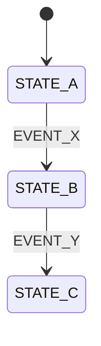
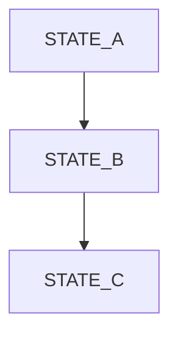
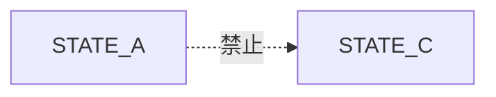
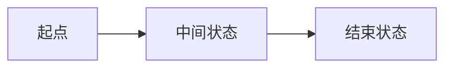

# Stage 1 - State

这个模板是全链路核心。

默认用图，不默认用表。

在状态没确认前，不要讨论 API 细节，也不要讨论环境变量。

## 1. 功能名

[填写]

## 2. State Scope

- [ ] `app-top-level`
- [ ] `feature-subflow`

## 3. 主状态图

这是第一张图，必须先有。



## 4. 主流程图

这是第二张图，帮助非工程视角先看懂体验流。



## 5. 禁止跳转图

这是第三张图，明确什么绝对不能发生。



## 6. 场景流程图

至少要有：

- 1 条 happy path
- 1 条 interrupt / error path



## 7. 嵌入式能力与后处理链

| CAPABILITY_ID | 类型 | 如何嵌入主流程 | 说明 |
| --- | --- | --- | --- |
| `EMBED_001` | [embedded/derived/post-processing] | [填写] | [填写] |

## 8. 状态 ID 表

| STATE_ID | 状态名 | 人话解释 |
| --- | --- | --- |
| `STATE_001` | [填写] | [填写] |
| `STATE_002` | [填写] | [填写] |

## 9. 事件 ID 表

| EVENT_ID | 事件名 | 谁触发的 | 什么时候发生 |
| --- | --- | --- | --- |
| `EVENT_001` | [填写] | [用户/系统/定时器/API] | [填写] |
| `EVENT_002` | [填写] | [填写] | [填写] |

## 10. 状态说明表

| 状态 | 人话解释 | 用户会看到什么 | 系统内部在做什么 |
| --- | --- | --- | --- |
| [STATE_A] | [填写] | [填写] | [填写] |
| [STATE_B] | [填写] | [填写] | [填写] |

## 11. 跳转规则表

这个表是图的校验结果，不是主入口。

| TRANSITION_ID | 当前状态 | 触发事件 | 下一状态 | 必做动作 |
| --- | --- | --- | --- | --- |
| `TRANS_001` | [STATE_A] | [EVENT_X] | [STATE_B] | [填写] |
| `TRANS_002` | [STATE_B] | [EVENT_Y] | [STATE_C] | [填写] |

## 12. 禁止跳转

| RULE_ID | 不允许的跳转 | 原因 |
| --- | --- | --- |
| `STATE_RULE_001` | [STATE_A] -> [STATE_C] | [填写] |

## 13. 细化顺序

如果系统较大，先定义：

1. 顶层主流程图
2. 再定义协议级或功能级子流程图

不要反过来。

## 14. 场景卡片

### 场景 A

- 现在在哪个状态：[填写]
- 发生了什么：[填写]
- 系统要做什么：[填写]
- 最后应该到哪里：[填写]

### 场景 B

- 现在在哪个状态：[填写]
- 发生了什么：[填写]
- 系统要做什么：[填写]
- 最后应该到哪里：[填写]

## 15. Machine View

```yaml
state_scope: app-top-level
states:
  - id: STATE_001
    name: ...
embedded_capabilities:
  - id: EMBED_001
    kind: embedded
    attach_to: STATE_001
events:
  - id: EVENT_001
    name: ...
transitions:
  - id: TRANS_001
    from: STATE_001
    event: EVENT_001
    to: STATE_002
forbidden:
  - id: STATE_RULE_001
    from: STATE_001
    to: STATE_003
```

## 16. 给 AI 的硬规则

- UI 只能消费状态，不得发明额外业务布尔值
- 所有业务跳转必须能在上表中找到
- 如果存在保存、提交、同步、导航，先写进“必做动作”，后面再解锁下阶段模板
- `STATE_ID / EVENT_ID / TRANSITION_ID` 一旦进入后续模板，不应无理由变更
- 先给图，再给表
- Stage 1 的主表达必须是流程图或状态图
- 如果某个能力不是独立流程，必须标注为 `embedded` 或 `post-processing`
